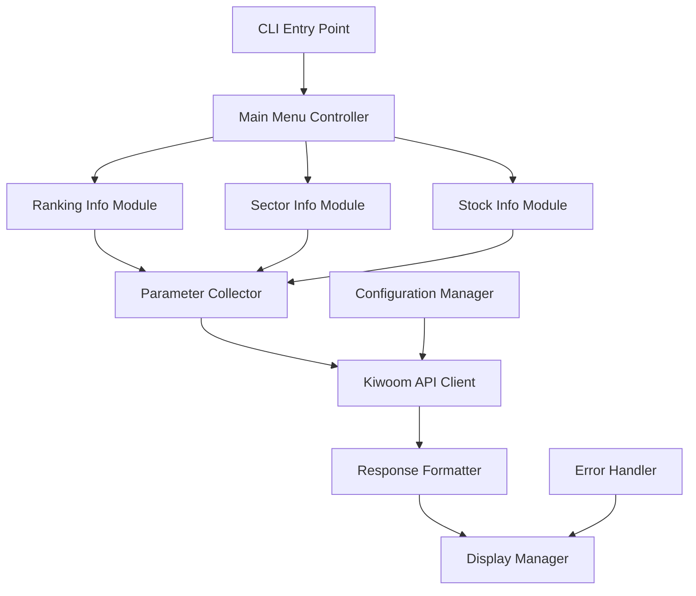

# Design Document

## Overview

The Stock Inquiry feature is an interactive CLI command that provides users with comprehensive access to Korean financial market data through the Kiwoom Securities API. The feature is organized into three main categories: ranking information (순위정보), sector analysis (업종), and detailed stock information (종목정보). Users navigate through an intuitive menu system powered by the inquirer library to select APIs and input parameters.

## Architecture

### High-Level Architecture



### Module Structure

The implementation follows the existing codebase patterns with separate modules for each API category:

```
apps/cluefin-cli/src/cluefin_cli/commands/inquiry/
├── __init__.py                    # Main inquiry command entry point
├── ranking_info.py               # 순위정보 APIs
├── sector_info.py                # 업종 APIs  
├── stock_info.py                 # 종목정보 APIs
├── parameter_collector.py        # Interactive parameter collection
├── display_formatter.py          # Result formatting and display
└── menu_controller.py            # Menu navigation logic
```

## Components and Interfaces

### 1. Main Command Interface

```python
@click.command()
@click.pass_context
def inquiry(ctx):
    """Interactive stock inquiry tool for Korean markets"""
    # Initialize Kiwoom client from context
    # Display main menu and handle navigation
```

### 2. Menu Controller

```python
class MenuController:
    def __init__(self, client: KiwoomClient):
        self.client = client
        self.ranking_info = RankingInfoModule(client)
        self.sector_info = SectorInfoModule(client)
        self.stock_info = StockInfoModule(client)
    
    def show_main_menu(self) -> str:
        """Display main category selection menu"""
        
    def handle_selection(self, category: str) -> None:
        """Route to appropriate module based on selection"""
```

### 3. API Module Interface

Each API category module follows a consistent interface:

```python
class BaseAPIModule:
    def __init__(self, client: KiwoomClient):
        self.client = client
        self.parameter_collector = ParameterCollector()
        self.formatter = DisplayFormatter()
    
    def show_api_menu(self) -> str:
        """Display available APIs for this category"""
        
    def execute_api(self, api_name: str) -> None:
        """Execute selected API with parameter collection"""
        
    def get_api_parameters(self, api_name: str) -> dict:
        """Collect required parameters for API"""
```

### 4. Parameter Collector

```python
class ParameterCollector:
    def collect_market_type(self) -> str:
        """Collect market selection (KOSPI/KOSDAQ)"""
        
    def collect_sort_type(self, options: List[Tuple[str, str]]) -> str:
        """Collect sorting preference"""
        
    def collect_date_input(self, prompt: str) -> str:
        """Collect date input with validation"""
        
    def collect_numeric_input(self, prompt: str, choices: List[str]) -> str:
        """Collect numeric selection from predefined choices"""
```

### 5. Display Formatter

```python
class DisplayFormatter:
    def format_ranking_data(self, data: Any) -> str:
        """Format ranking API responses into readable tables"""
        
    def format_sector_data(self, data: Any) -> str:
        """Format sector API responses"""
        
    def format_stock_data(self, data: Any) -> str:
        """Format stock information responses"""
        
    def create_table(self, headers: List[str], rows: List[List[str]]) -> str:
        """Create formatted table using rich library"""
```

## Data Models

### API Configuration

```python
from pydantic import BaseModel, Field
from typing import List, Optional, Tuple

class ParameterConfig(BaseModel):
    name: str
    korean_name: str
    param_type: str  # 'select', 'text', 'date'
    choices: Optional[List[Tuple[str, str]]] = None
    validation: Optional[str] = None

class APIConfig(BaseModel):
    name: str
    korean_name: str
    api_method: str
    required_params: List[ParameterConfig]
    optional_params: List[ParameterConfig] = Field(default_factory=list)
```

### Menu Definitions

```python
RANKING_APIS = [
    APIConfig(
        name="rapidly_increasing_trading_volume",
        korean_name="거래량 급증 요청",
        api_method="get_rapidly_increasing_trading_volume",
        required_params=[
            ParameterConfig("mrkt_tp", "시장구분", "select", [("000", "전체"), ("001", "코스피"), ("101", "코스닥")]),
            ParameterConfig("sort_tp", "정렬구분", "select", [("1", "급증량"), ("2", "급증률"), ("3", "급감량"), ("4", "급감률")]),
            # ... more parameters
        ]
    ),
    # ... more APIs
]

SECTOR_APIS = [
    APIConfig(
        name="industry_investor_net_buy", 
        korean_name="업종별 투자자 순매수 요청",
        api_method="get_industry_investor_net_buy",
        required_params=[
            ParameterConfig("mrkt_tp", "시장구분", "select", [("0", "코스피"), ("1", "코스닥")]),
            ParameterConfig("base_dt", "기준일자", "date"),
            # ... more parameters
        ]
    ),
    # ... more APIs
]

STOCK_APIS = [
    APIConfig(
        name="trading_volume_renewal",
        korean_name="거래량갱신요청", 
        api_method="get_trading_volume_renewal",
        required_params=[
            ParameterConfig("stk_cd", "종목코드", "text"),
            # ... more parameters
        ]
    ),
    # ... more APIs
]
```

## Error Handling

### Error Categories

1. **API Errors**: Network issues, authentication failures, rate limits
2. **Validation Errors**: Invalid parameter values, missing required fields
3. **User Input Errors**: Invalid menu selections, malformed input
4. **Display Errors**: Formatting issues, encoding problems

### Error Handling Strategy

```python
class InquiryErrorHandler:
    def handle_api_error(self, error: KiwoomAPIError) -> bool:
        """Handle API-related errors with retry logic"""
        
    def handle_validation_error(self, error: ValidationError) -> bool:
        """Handle parameter validation errors"""
        
    def handle_user_input_error(self, error: Exception) -> bool:
        """Handle user input errors gracefully"""
        
    def display_error_message(self, message: str, error_type: str) -> None:
        """Display formatted error messages"""
```

## Testing Strategy

### Unit Tests

1. **Menu Navigation Tests**: Verify menu display and selection logic
2. **Parameter Collection Tests**: Test input validation and collection
3. **API Integration Tests**: Mock API responses and test data processing
4. **Display Formatting Tests**: Verify table formatting and Korean text handling

### Integration Tests

1. **End-to-End Flow Tests**: Complete user journey from menu to results
2. **API Client Tests**: Real API calls with test credentials (marked with `@pytest.mark.integration`)
3. **Error Scenario Tests**: Network failures, invalid credentials, rate limits

### Test Structure

```python
# Unit tests
tests/unit/commands/inquiry/
├── test_menu_controller.py
├── test_parameter_collector.py
├── test_display_formatter.py
├── test_ranking_info.py
├── test_sector_info.py
└── test_stock_info.py

# Integration tests  
tests/integration/commands/inquiry/
├── test_inquiry_flow.py
├── test_api_integration.py
└── test_error_scenarios.py
```

## Implementation Details

### Korean Text Handling

- Use UTF-8 encoding throughout the application
- Implement proper text width calculation for Korean characters in table formatting
- Handle Korean input validation for stock codes and names

### Interactive Menu System

- Use inquirer library for consistent menu interfaces
- Implement keyboard navigation (arrow keys, enter, escape)
- Provide clear visual feedback for selections
- Support both Korean and English menu options

### API Response Caching

- Implement optional response caching for frequently accessed data
- Use file-based caching with configurable TTL
- Cache key generation based on API endpoint and parameters

### Configuration Management

- Store API configurations in separate JSON/YAML files
- Support environment-specific configurations (dev/prod)
- Allow users to customize default parameter values

### Performance Considerations

- Implement pagination for large result sets
- Use async/await for concurrent API calls where applicable
- Optimize table rendering for large datasets
- Implement request throttling to respect API rate limits

## Dependencies

### Existing Dependencies

- `cluefin-openapi`: Kiwoom API client
- `click`: CLI framework
- `pydantic`: Data validation
- `loguru`: Logging

## Security Considerations

- Never log sensitive API credentials
- Validate all user inputs to prevent injection attacks
- Implement proper error messages that don't expose internal details
- Use secure credential storage for API tokens