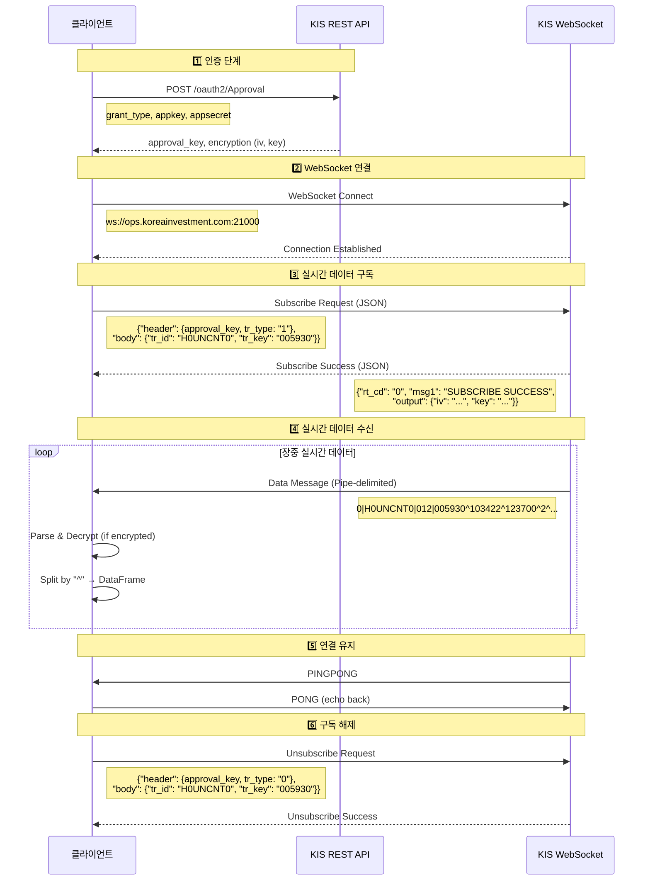
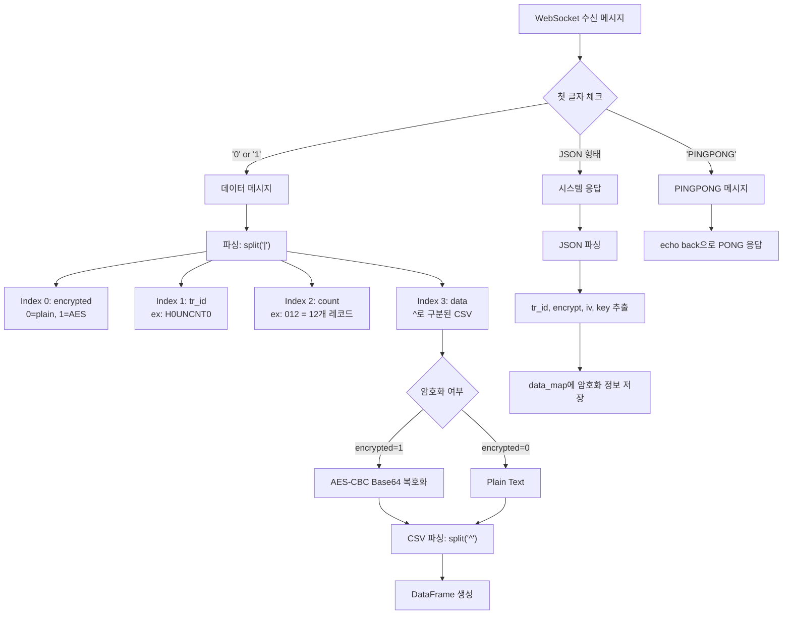
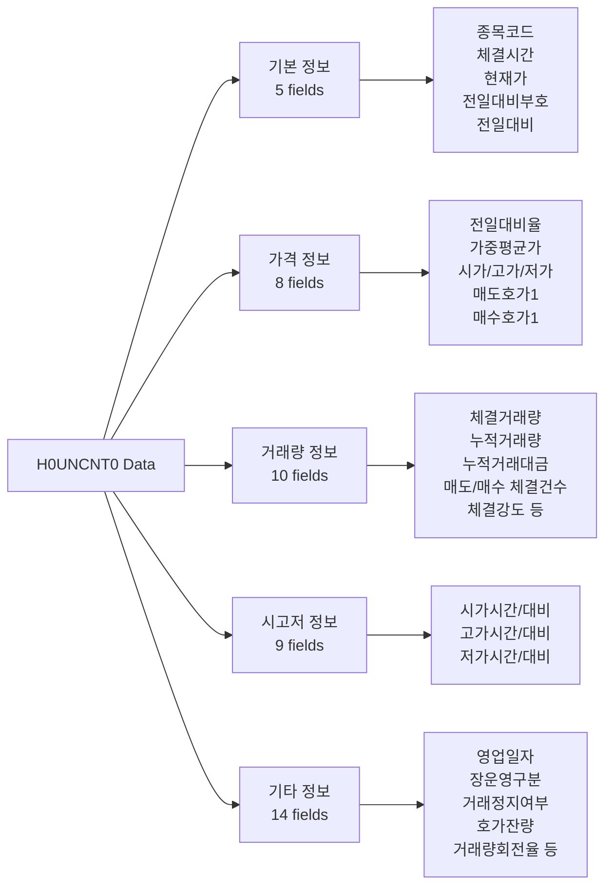
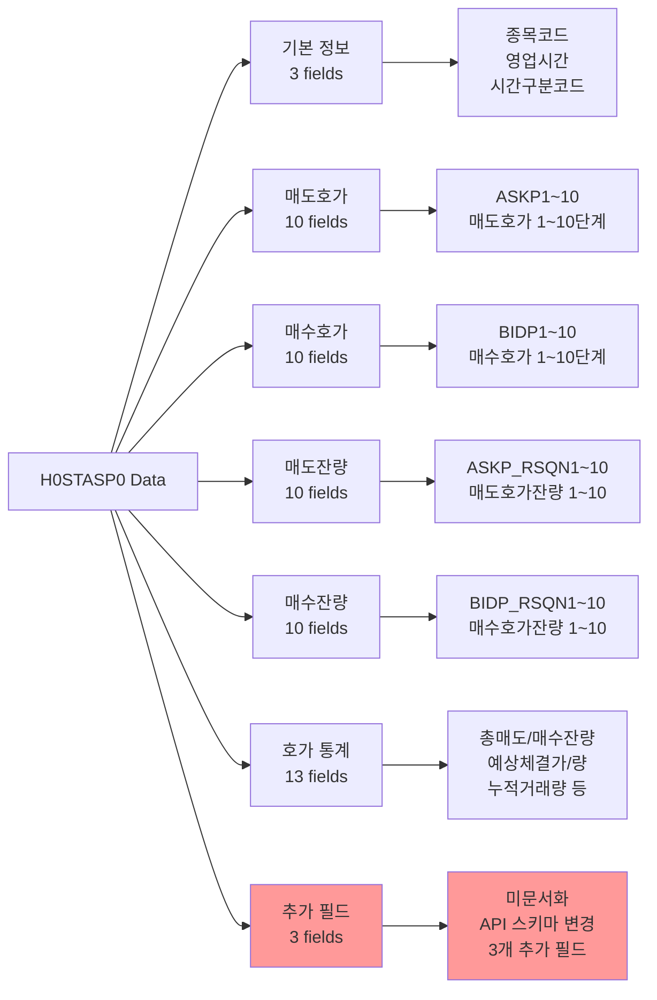
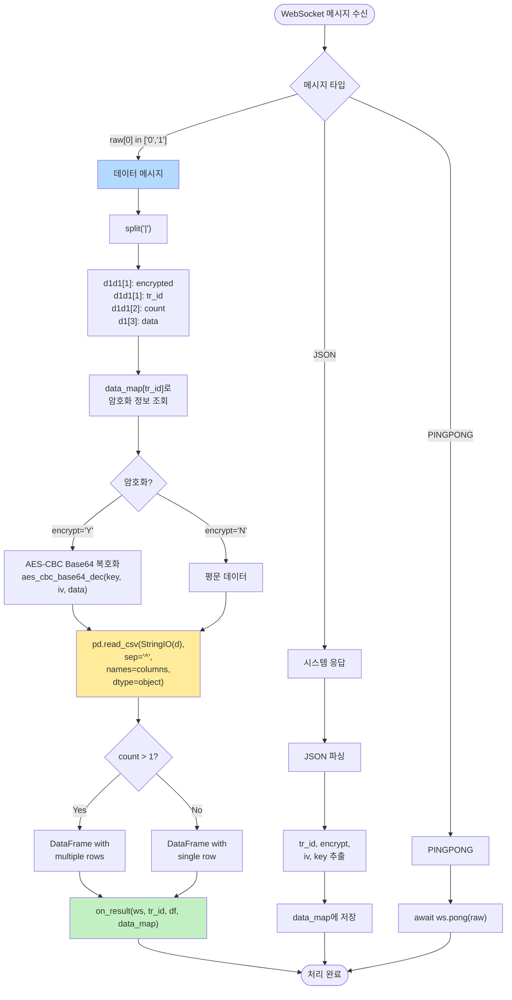
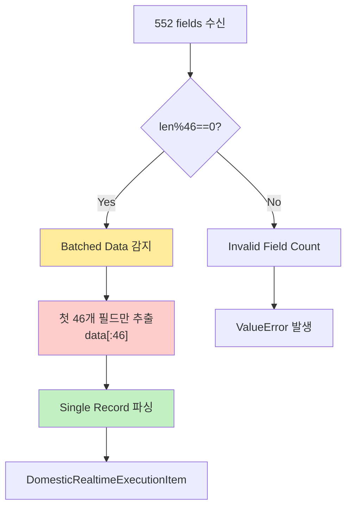
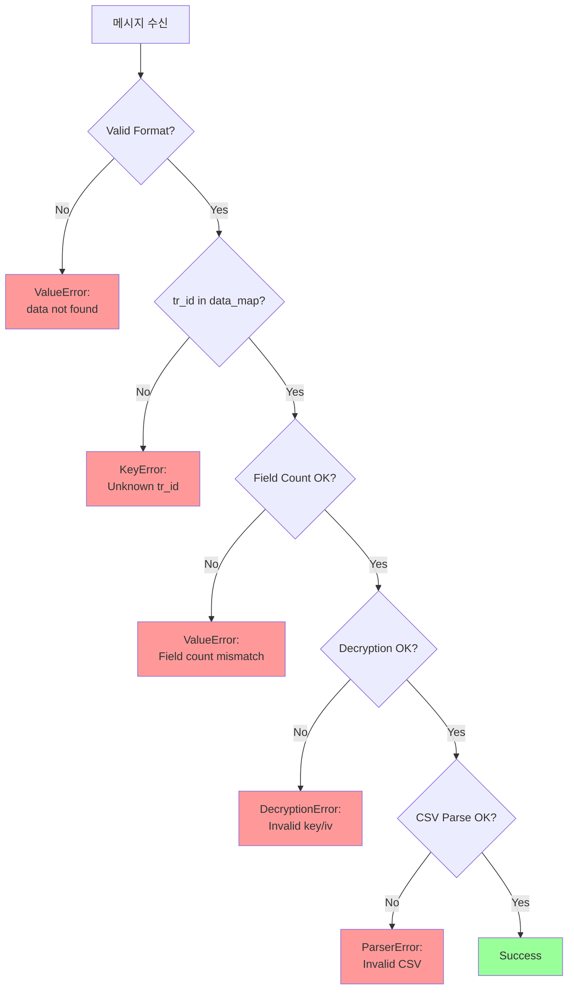

# 한국투자증권 WebSocket API 메시지 구조 및 데이터 흐름

## 1. 전체 데이터 플로우 (Sequence Diagram)



## 2. WebSocket 메시지 구조

### 2.1 메시지 타입별 포맷



### 2.2 데이터 메시지 상세 구조

```
┌─────────────────────────────────────────────────────────────────────┐
│                    WebSocket Data Message Format                    │
├─────────────────────────────────────────────────────────────────────┤
│                                                                     │
│  encrypted | tr_id    | count | data                                │
│  ─────────┬──────────┬───────┬─────────────────────────────────     │
│     0     │ H0UNCNT0 │  012  │ 005930^103422^123700^2^3800^...      │
│     ▲     │    ▲     │   ▲   │           ▲                          │
│     │     │    │     │   │   │           │                          │
│     │     │    │     │   │   │           └─ CSV data (^ delimited)  │
│     │     │    │     │   │   │                                      │
│     │     │    │     │   └───┴─ 12 records batched                  │
│     │     │    │     │                                              │
│     │     │    └─────────────── Transaction ID                      │
│     │     │                                                         │
│     └─────┴─────────────────── 0: Plain, 1: AES Encrypted           │
│                                                                     │
└─────────────────────────────────────────────────────────────────────┘
```

## 3. H0UNCNT0 (실시간 체결가) 상세

### 3.1 구독 요청 메시지

```json
{
  "header": {
    "approval_key": "08b3c13e-1a7e-4f1c-b20d-417582e3b3a0",
    "custtype": "P",
    "tr_type": "1",
    "content-type": "utf-8"
  },
  "body": {
    "input": {
      "tr_id": "H0UNCNT0",
      "tr_key": "005930"
    }
  }
}
```

### 3.2 데이터 메시지 필드 (46개)



### 3.3 실제 데이터 예시

```
Raw Message:
0|H0UNCNT0|012|005930^103422^123700^2^3800^3.17^122292.62^120200^...

Parsed (첫 번째 레코드):
┌──────────────────────┬────────────┐
│ Field                │ Value      │
├──────────────────────┼────────────┤
│ MKSC_SHRN_ISCD       │ 005930     │  ← 삼성전자
│ STCK_CNTG_HOUR       │ 103422     │  ← 10:34:22
│ STCK_PRPR            │ 123700     │  ← 현재가
│ PRDY_VRSS_SIGN       │ 2          │  ← 상승
│ PRDY_VRSS            │ 3800       │  ← +3,800원
│ PRDY_CTRT            │ 3.17       │  ← +3.17%
│ ...                  │ ...        │
└──────────────────────┴────────────┘

Note: count=012 → 12개 레코드가 concatenated
      → 12 × 46 = 552 fields total
```

## 4. H0STASP0 (실시간 호가) 상세

### 4.1 구독 요청 메시지

```json
{
  "header": {
    "approval_key": "6124d873-6248-4bca-952e-76eb0c352a51",
    "custtype": "P",
    "tr_type": "1",
    "content-type": "utf-8"
  },
  "body": {
    "input": {
      "tr_id": "H0STASP0",
      "tr_key": "005930"
    }
  }
}
```

### 4.2 데이터 메시지 필드 (59개, 실제 62개 반환)



### 4.3 실제 데이터 예시

```
Raw Message:
0|H0STASP0|001|005930^104025^0^123900^124000^124100^124200^...

Parsed:
┌──────────────────────┬────────────┐
│ Field                │ Value      │
├──────────────────────┼────────────┤
│ MKSC_SHRN_ISCD       │ 005930     │  ← 삼성전자
│ BSOP_HOUR            │ 104025     │  ← 10:40:25
│ HOUR_CLS_CODE        │ 0          │  ← 장중
│ ASKP1                │ 123900     │  ← 매도1호가
│ ASKP2                │ 124000     │  ← 매도2호가
│ ...                  │ ...        │
│ BIDP1                │ 123800     │  ← 매수1호가
│ BIDP2                │ 123700     │  ← 매수2호가
│ ...                  │ ...        │
│ ASKP_RSQN1           │ 27292      │  ← 매도1잔량
│ ...                  │ ...        │
│ Unknown Field 60     │ ???        │  ⚠️ API 변경
│ Unknown Field 61     │ ???        │  ⚠️ 미문서화
│ Unknown Field 62     │ ???        │  ⚠️ 추가 필드
└──────────────────────┴────────────┘

Note: 문서상 59개이나 실제 62개 반환
      → 처음 59개만 사용, 나머지 3개는 무시
```

## 5. 데이터 파싱 플로우



## 6. 배치 데이터 처리 로직

### 6.1 배치 처리 시나리오

```
장중 고빈도 거래 시:
┌─────────────────────────────────────────────────────┐
│ WebSocket이 여러 체결을 batch로 전송                     │
├─────────────────────────────────────────────────────┤
│                                                     │
│  count = 012 (12개 레코드)                            │
│                                                     │
│  Record 1: 005930^103422^123700^...  (46 fields)    │
│  Record 2: 005930^103423^123750^...  (46 fields)    │
│  Record 3: 005930^103424^123800^...  (46 fields)    │
│  ...                                                │
│  Record 12: 005930^103433^124200^... (46 fields)    │
│                                                     │
│  Total: 12 × 46 = 552 fields                        │
│                                                     │
└─────────────────────────────────────────────────────┘

pandas.read_csv()는 자동으로 '\n' 구분자 인식
→ DataFrame with 12 rows × 46 columns
```

### 6.2 현재 cluefin-openapi 구현



**⚠️ 현재 구현의 한계:**
- Batch된 데이터 중 첫 번째 레코드만 파싱
- 나머지 11개 레코드는 버려짐
- 고빈도 거래 시 데이터 손실 가능

**✅ 개선 방안:**
```python
# Option 1: 모든 레코드 반환
@staticmethod
def parse_execution_data_all(data: List[str]) -> List[DomesticRealtimeExecutionItem]:
    """Parse all batched records."""
    field_count = len(EXECUTION_FIELD_NAMES)
    record_count = len(data) // field_count

    results = []
    for i in range(record_count):
        start = i * field_count
        end = start + field_count
        record = data[start:end]

        field_dict = dict(zip(EXECUTION_FIELD_NAMES, record))
        results.append(DomesticRealtimeExecutionItem.model_validate(field_dict))

    return results
```

## 7. 에러 처리 및 예외 상황



## 8. 실전 사용 예시

### 8.1 기본 구독 패턴

```python
from cluefin_openapi.kis import Auth, SocketClient, DomesticRealtimeQuote
import asyncio

async def main():
    # 1. 인증
    auth = Auth(app_key="...", secret_key="...", env="dev")
    approval = auth.approve()

    # 2. WebSocket 연결
    async with SocketClient(
        approval_key=approval.approval_key,
        app_key="...",
        secret_key="...",
        env="dev"
    ) as client:
        realtime = DomesticRealtimeQuote(client)

        # 3. 구독
        await realtime.subscribe_execution("005930")  # 삼성전자
        await realtime.subscribe_orderbook("005930")

        # 4. 실시간 데이터 수신
        async for event in client.events():
            if event.event_type == "data":
                if event.tr_id == "H0UNCNT0":
                    # 체결가 데이터
                    execution = realtime.parse_execution_data(event.data["values"])
                    print(f"체결: {execution.stck_prpr}원")

                elif event.tr_id == "H0STASP0":
                    # 호가 데이터
                    orderbook = realtime.parse_orderbook_data(event.data["values"])
                    print(f"매도1: {orderbook.askp1}, 매수1: {orderbook.bidp1}")

asyncio.run(main())
```

### 8.2 장중 시간대별 데이터 특성

```
09:00 - 09:05  장 시작 │ 초당 10~50개 체결 (고빈도 batching)
09:05 - 11:30  오전장  │ 초당 1~10개 체결 (중간 빈도)
11:30 - 12:30  점심    │ 데이터 없음 (timeout/skip)
12:30 - 15:20  오후장  │ 초당 1~10개 체결
15:20 - 15:30  장 마감 │ 초당 10~100개 체결 (최고빈도 batching)
15:30 - 09:00  장외    │ 데이터 없음 (subscription은 유지)
```


## 10. 참고 자료

- **공식 문서:** https://apiportal.koreainvestment.com/
- **예제 코드:** https://github.com/koreainvestment/open-trading-api
- **cluefin-openapi:** `packages/cluefin-openapi/src/cluefin_openapi/kis/`
  - `_socket_client.py`: WebSocket 클라이언트 구현
  - `_domestic_realtime_quote.py`: H0UNCNT0/H0STASP0 파서
  - `_domestic_realtime_quote_types.py`: Pydantic 모델 정의
